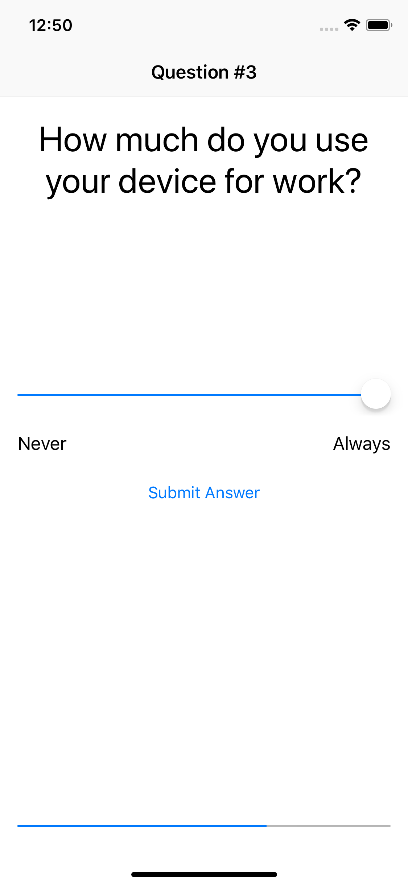

# Personality Quiz
## Initial Features
### -Added questions to determine which device the player is
### -Added a home screen to start the game
### -Added a question screen
### -Added a result screen

## Added Features
### -Added questions to determine which animal the player is
### -Added a picker to choose between the device questions and animal questions
### -Updated the progress bar to show the correct progress
### -Updated the question label to show the correct question number

### Homescreen device questions
<kbd></kbd>

### Device question one
<kbd></kbd>

### Device question two
<kbd></kbd>

### Device question three
<kbd></kbd>

### Device result
<kbd></kbd>

### Homescreen animal questions
<kbd></kbd>

### Animal question one
<kbd></kbd>

### Animal question two
<kbd></kbd>

### Animal question three
<kbd></kbd>

### Animal result
<kbd></kbd>
